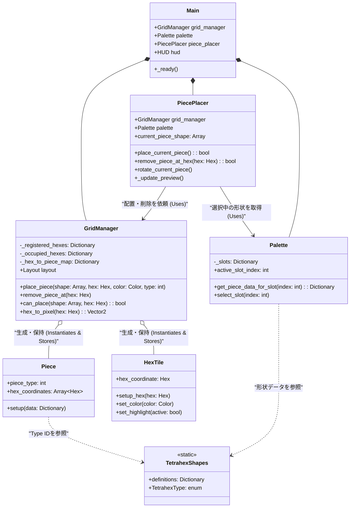

# Class Diagram

現在のプロジェクト（Hex World）のクラス構造と関係性を示します。

## クラスの責務概要

### Main
ゲームのエントリーポイント。
各コンポーネント（GridManager, Palette, PiecePlacer）を保持し、それらの依存関係を注入（Setup）する役割を担います。また、トップレベルの入力イベント（数字キーなど）の一部を処理します。

### GridManager
**盤面の管理者**。
- **論理**: どのHexがグリッド内か、どのHexが埋まっているか、どこにどのPieceがあるかを管理します。
- **配置**: `place_piece` で `Piece` ノードを生成し、配置します。
- **削除**: `remove_piece_at` で `Piece` ノードを削除します。
- **視覚**: `HexTile` を生成し、グリッドを描画します。

### PiecePlacer
**配置操作のコントローラー**。
- ユーザーの入力（マウス移動、クリック）を監視し、プレビュー（マウス追従、スナップ）を表示します。
- 配置が可能か `GridManager` に問い合わせ、可能であれば配置を依頼します。
- 「どこに置こうとしているか」を管理し、「実際に置く」のは `GridManager` に任せます。

### Palette / PaletteUI
**手持ちの駒（形状）の管理者**。
- どのスロットにどの形状（TetrahexType）が割り当てられているかを管理します。
- 選択中のスロット状態を管理します。

### Piece
**配置されたオブジェクトの実体**。
- シーン上に存在する `Node2D` です。
- 自身の種類（`piece_type`）や、占有しているHex座標（`hex_coordinates`）を保持します。
- 今後、インベントリや稼働状態などのロジックはここに追加されます。
